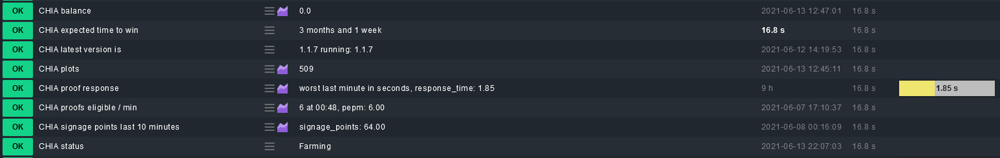

# cmk_chia
Check_mk local check for chia blockchain. Working with docker and non-docker installations (configurable)
# features
Monitor status, plot count, latest version, eligible proofs last minute, proof response time, signage points. \
Configurable debug.log location, Chia cmd (docker / non-docker), monitoring thresholds \
disable unwanted checks simply by commenting function calls at the bottom of the script

# installation
Copy this script to youre local check_mk agent installation directory for example: /usr/lib/check_mk_agent/local/chia \
configure variables CHIACMD,DBGLOG. Thresholds are Optional and should fit most scenarios with default values
